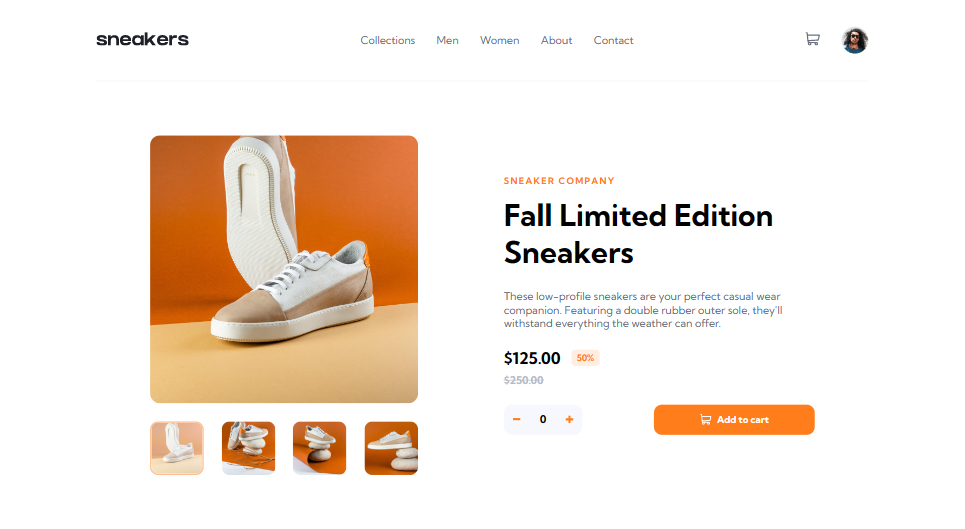
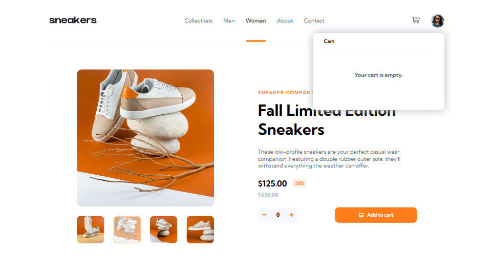
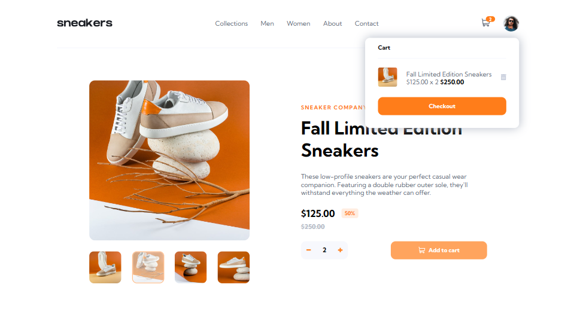
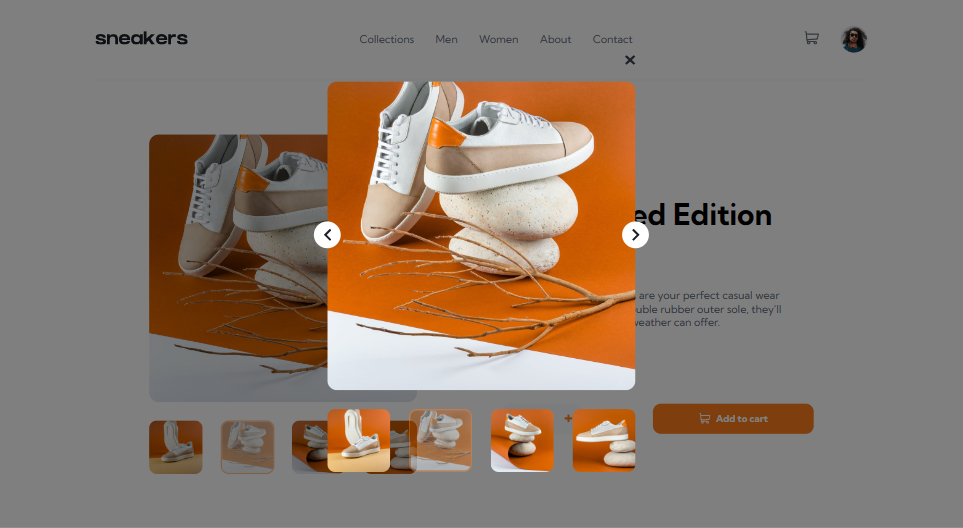
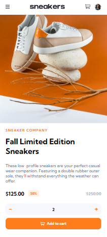
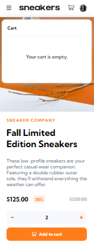
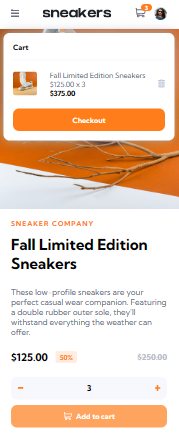
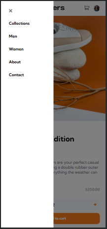

# E-Commerce Product Page

This is a solution to the [E-commerce product page challenge on Frontend Mentor](https://www.frontendmentor.io/challenges/ecommerce-product-page-UPsZ9MJp6).

## Table of contents

- [The challenge](#the-challenge)
- [Built with](#built-with)
- [What I learned](#what-i-learned)
- [Continued development](#continued-development)
- [Useful resources](#useful-resources)
- [Screenshots](#screenshots)

### The challenge

Users should be able to:

- View the optimal layout for the site depending on their device's screen size
  (Solution available for Mobile View (<=480px) Desktop View (>=1201px))
- See hover states for all interactive elements on the page
- Open a lightbox gallery by clicking on the large product image
- Switch the large product image by clicking on the small thumbnail images
- Switch the product image to the next or previous on, by clicking on the buttons
- Add items to the cart
- View the cart and remove items from it

### Built with

- Semantic HTML5 markup
- CSS custom properties
- Flexbox
- Media Queries
- Vanilla JavaScript ES6+
- Desktop-first workflow

### What I learned

- How to build a full-length navbar with a smooth translation;
- How to apply filter effects to an element (ex., an svg image);
- How to target different screen sizes, by checking the media queries, in JavaScript (MediaQueryList, matches property and 'change' event (not used, but learned));

```js
//ANTES
const mediaQueryList = window.matchMedia('(max-width: 480px)');

mediaQueryList.onchange = (eventObject) => {
  //quando passo para uma media query diferente (quando estou a testar a responsiveness por emulação dos vários dispositivos, aumentando/diminuindo a width do ecrã), o evento 'change' é disparado*
  if(eventObject.matches === true){
    //code goes here
    //console.log(eventObject);
    //MediaQueryListEvent {isTrusted: true, media: '(max-width: 480px)', matches: true, ...}
    //*portanto, se ultrapassar 2 media queries, vai imprimir 2 vezes o eventObject.
  }else{
    //code goes here
  };
};

//DEPOIS
const mediaQueryList = window.matchMedia('(max-width: 480px)');
//console.log(mediaQueryList);
//MediaQueryList {media: '(max-width: 480px)', matches: true, onchange: null}

if(mediaQueryList.matches === true){
  //code goes here - do not display lightbox
}else{
  //code goes here - display lightbox
};


//NOTA: Alterei o código para, no lugar de detetar alterações de media queries/dimensões do ecrã, detetar, simplesmente, em que range é que a dimensão atual se encontra. Esta opção faz mais sentido para mim, visto que: (1) na realidade, não posso esticar a janela de visualização do meu dispositivo. Podia simular, eventualmente, as transições, num teste de responsiveness, usando as ferramentas de programador, mas isso não é muito relevante para o utilizador comum. (2) ao usar o evento 'change', só quando passasse por um limite de uma media query é que ia testar se a width do meu ecrã estaria dentro ou não... ou seja, se abrisse a página no Desktop, não ia ver lightbox nenhuma pq o display ia continuar set to none. Assim (conforme o código está), se abre a página do tlmv, não vê lightbox; se abre no pc, vê lightbox e pronto. Só não me posso esquecer, enquanto programadora, de quando for testar a responsividade ter de atualizar a página. Pq se abro no desktop e depois diminuir o ecrã para mobile, se clicar na imagem, a lightbox vai aparecer na mesma pq a página foi aberta em desktop (e vice-versa). O user não vai ter este ""problema"".
```

### Continued development
- An equivalent solution for iPad, tablet & other small screens

### Useful resources

- [Convert Hex colors to CSS filter](https://isotropic.co/tool/hex-color-to-css-filter/) - This helped me to change the color of an svg image, whenever the user hovers over it, without needing to create a copy with a different fill
- [MediaQueryList](https://www.w3schools.com/howto/howto_js_media_queries.asp)
- [Change Event](https://developer.mozilla.org/en-US/docs/Web/API/MediaQueryList/change_event)

### Screenshots










